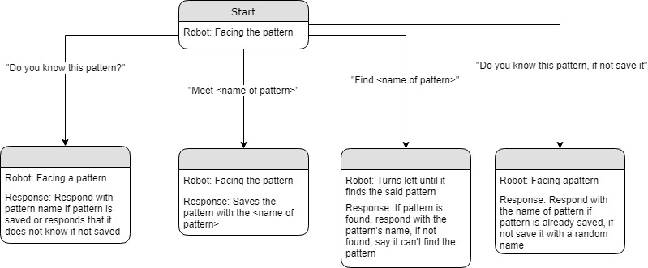

# Voice Controlled Pattern Recognition Robot
ECE 4180 Spring 2019 Final Project
# Authors
Caleb Martinez, Alexander Meyer, and Jongheon Park
# Table of Contents
- [Overview](README.md#overview)
- [Commands Diagram](README.md#commands-diagram)
- [Running the Code](README.md#running-the-code)
- [Parts List](README.md#parts-list)
- [Running the Code](README.md#instruction)
- [Demo Video](README.md#demo-video)

# Overview
This project aims to create a stationary robot that can recognize and save color patterns. It uses a Pixy2 camera to process color recognitio, a Raspberry Pi to interface with the Pixy2 and to control the robot's camera rotation, and Google Cloud Assistant API to implement voice control.


# Commands Diagram
Commands diagram of the robot



# Parts List
Hardware Used
- Raspberry Pi
- Pixy2 Camera
- AIY Voice Kit (V1)
- mbed LPC1768
- Shadow Robot

Software Used
- Pixymon
- C++
- Python 3
- Google Cloud Assistant API

# Instruction
After obtaining the hardware, follow the instructions that came with each part to setup the environment.
- Raspberry Pi
  - https://projects.raspberrypi.org/en/projects/raspberry-pi-getting-started
  - https://www.raspberrypi.org/help/noobs-setup/2/
 
- Pixy2 Camera
  - https://docs.pixycam.com/wiki/doku.php?id=wiki:v2:pixy_regular_quick_start
  - https://docs.pixycam.com/wiki/doku.php?id=wiki:v2:hooking_up_pixy_to_a_raspberry_pi

- AIY Voice Kit (V1)
  - https://aiyprojects.withgoogle.com/voice-v1/
 
- Running the Code
  - Building
    - Download the files to a directory and open terminal in that directory
    - ``` ./pixy2/scripts/build_get_blocks_cpp_demo.sh ```
  - Running the Program
    - ```cd ./pixy2/build/get_lines_cpp_demo```
    - ```sudo ./get_blocks_cpp_demo```

# Demo Video
https://youtu.be/vAxhfJvpplg 
Demo Video of Robot Operations  (Read Discription for information, Volume on)

# Patterns in Demo

Miles  
Sam  
Carlos 
Stacey 
Self-Naming 
Self-Naming 
